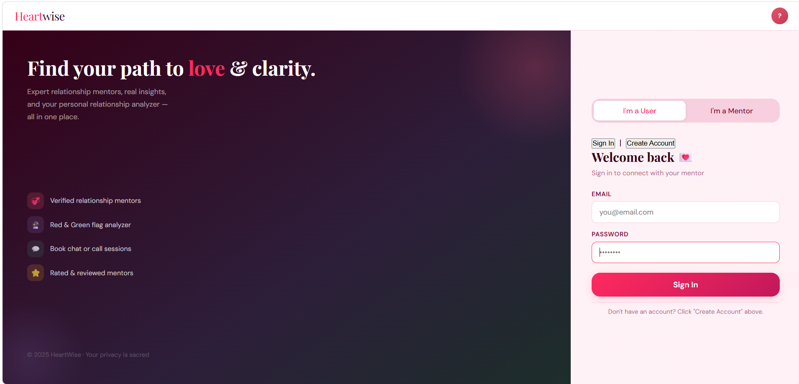
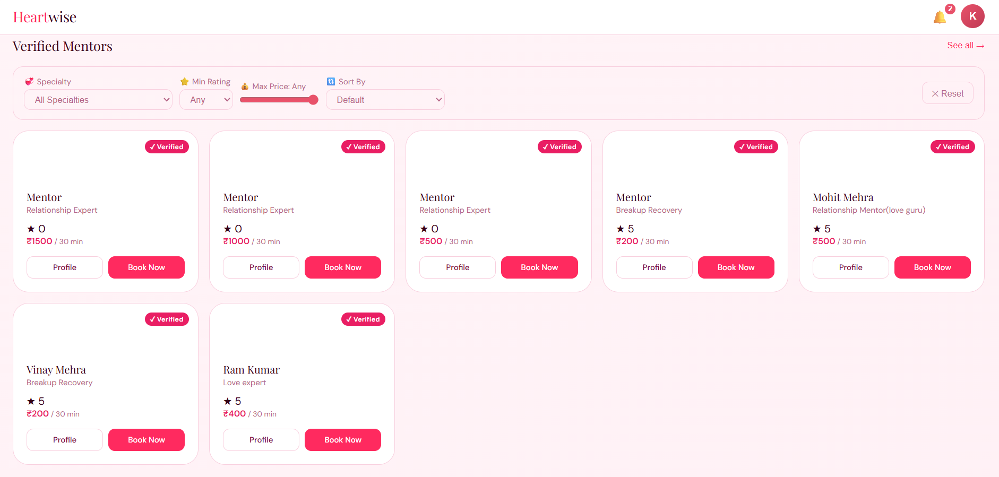
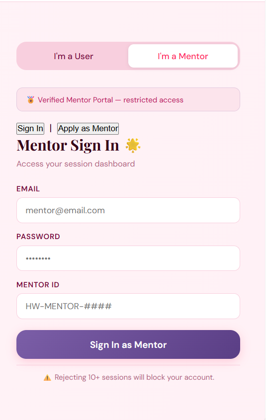
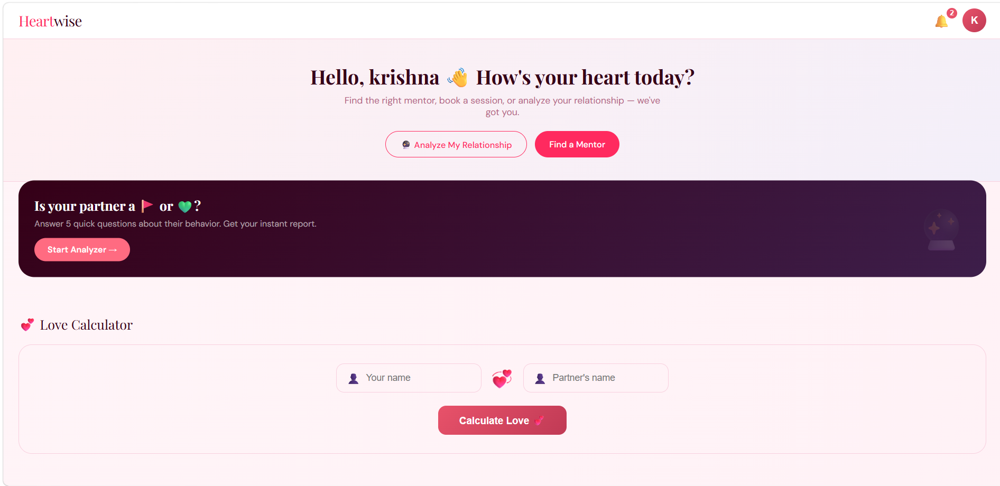
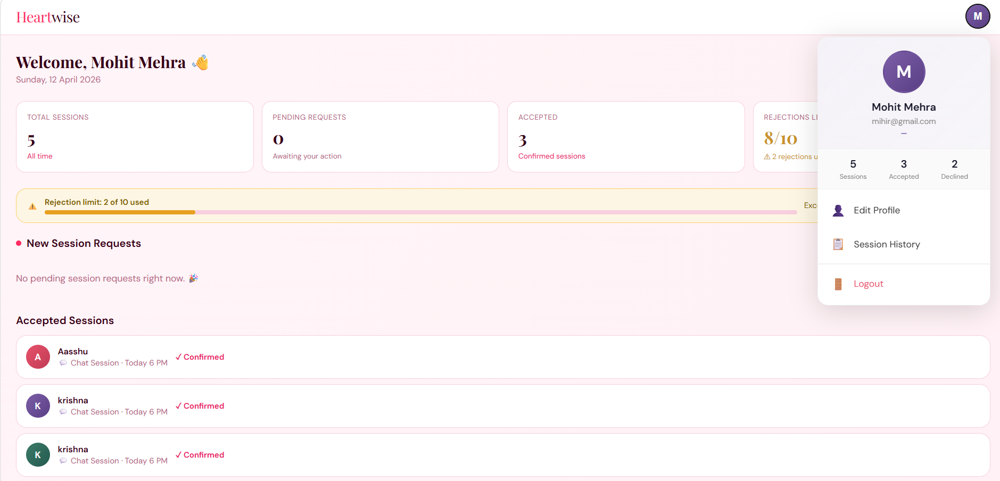

#  HeartWise — Relationship Mentor Booking Platform

> A full-stack web application connecting users with verified relationship mentors for chat and call sessions, featuring a relationship analyzer, love calculator, and real-time booking system.

---

## 🌐 Live Demo

| Service | URL |
|---------|-----|
|  Frontend | [heartwise.vercel.app](https://heartwise.vercel.app) |
|  Backend API | [heartwise-backend-production.up.railway.app](https://heartwise-backend-production.up.railway.app/api/mentors) |

---

## Screenshots

### Login Page (Desktop)


### Mentor Dashboard


### Login Page (Mobile)
Clean mobile-responsive login with User / Mentor toggle and Sign In / Create Account modes.

### User Home
Browse verified mentors, filter by specialty/rating/price, use the Love Calculator, and analyze your relationship.

### Mentor Dashboard
Real-time session requests with Accept / Decline, session history, rejection tracking, and profile management.

---

## Features

###  User Side
-  Register & Login with JWT token authentication
-  Browse verified mentors with **filters** (Specialty, Rating, Price, Experience)
-  Book **Chat or Call** sessions with any mentor
-  View **Booking History** (Pending / Accepted / Declined)
-  **Real-time notifications** when mentor accepts or declines
-  **Relationship Analyzer** — 5-question red flag / green flag quiz
-  **Love Calculator** — 4-factor algorithm (Common Letters, Numerology, Name Length, First Letter)
-  Profile dropdown with name, email, notifications, booking history

###  Mentor Side
-  Register with full profile (Name, DOB, Gender, Specialty, Skills, Languages, Price, Experience, Profile Picture)
-  **Dashboard** with real-time metrics (Total Sessions, Pending, Accepted, Rejections Left)
- ✅ Accept / ❌ Decline session requests (max 10 rejections — account blocked if exceeded)
-  **Session History** with filter tabs (All / Pending / Accepted / Declined)
-  **Edit Profile** — update all details including profile picture
-  Profile dropdown with stats and quick actions

---

## Tech Stack

### Frontend
| Technology | Usage |
|-----------|-------|
| HTML | Page structure |
| CSS | Styling with CSS variables |
| JavaScript | Logic & API calls |
| Vercel | Hosting |

### Backend
| Technology | Usage |
|-----------|-------|
| Java 17 | Language |
| Spring Boot 3 | Framework |
| Spring Data JPA | Database ORM |
| MySQL | Database |
| Railway | Hosting |
| Docker | Containerization |

---

## 📁 Project Structure

```
heartwise/
├── frontend/
│   ├── css/
│   │   ├── variables.css
│   │   ├── base.css
│   │   ├── navbar.css
│   │   ├── components.css
│   │   ├── login.css
│   │   ├── home.css
│   │   ├── dashboard.css
│   │   ├── analyzer.css
│   │   └── profile.css
│   ├── html/
│   │   ├── index.html              ← Login / Register
│   │   ├── home.html               ← User Home
│   │   ├── dashboard.html          ← Mentor Dashboard
│   │   ├── analyzer.html           ← Relationship Analyzer
│   │   ├── mentorprofile.html      ← Mentor Profile & Booking
│   │   ├── bookings.html           ← User Booking History
│   │   ├── mentor-edit-profile.html← Mentor Edit Profile
│   │   └── mentor-sessions.html    ← Mentor Session History
│   └── js/
│       ├── utils.js                ← Shared utilities & auth guards
│       ├── api.js                  ← All backend API calls
│       ├── auth.js                 ← Login & Register logic
│       ├── authGuard.js            ← Route protection
│       ├── home.js                 ← Home page + Love Calculator + Filters
│       ├── dashboard.js            ← Mentor dashboard logic
│       ├── analyzer.js             ← Relationship analyzer logic
│       └── profile.js              ← Mentor profile page logic
│
└── backend/
    ├── src/main/java/com/heartwise/backend/
    │   ├── config/
    │   │   └── CorsConfig.java     ← Global CORS configuration
    │   ├── controller/
    │   │   ├── AuthController.java ← Login & Register endpoints
    │   │   ├── MentorController.java← GET/PUT mentor endpoints
    │   │   └── BookingController.java← Sessions & Notifications
    │   ├── dto/
    │   │   ├── AuthResponse.java
    │   │   ├── LoginRequest.java
    │   │   ├── RegisterRequest.java
    │   │   └── BookingRequest.java
    │   ├── entity/
    │   │   ├── User.java
    │   │   ├── Mentor.java
    │   │   ├── Booking.java
    │   │   └── Notification.java
    │   └── repository/
    │       ├── UserRepository.java
    │       ├── MentorRepository.java
    │       ├── BookingRepository.java
    │       └── NotificationRepository.java
    ├── Dockerfile
    └── src/main/resources/
        └── application.properties
```

---

## Database Schema

```sql
users        (id, name, email, password, role)
mentors      (id, firstName, lastName, email, password, specialty, skills,
              languages, experience, price, rating, gender, dob, profilePicture)
bookings     (id, user_id, mentor_id, sessionType, slot, status)
notifications(id, user_id, message, type, is_read)
```

---

##  API Endpoints

### Auth
| Method | Endpoint | Description |
|--------|----------|-------------|
| POST | `/api/auth/user/login` | User login |
| POST | `/api/auth/user/register` | User register |
| POST | `/api/auth/mentor/login` | Mentor login |
| POST | `/api/auth/mentor/register` | Mentor register |

### Mentors
| Method | Endpoint | Description |
|--------|----------|-------------|
| GET | `/api/mentors` | Get all mentors |
| GET | `/api/mentors/:id` | Get mentor by ID |
| PUT | `/api/mentors/:id` | Update mentor profile |

### Sessions
| Method | Endpoint | Description |
|--------|----------|-------------|
| POST | `/api/sessions/book` | Book a session |
| GET | `/api/sessions/user/:id` | Get user's bookings |
| GET | `/api/sessions/mentor/:id` | Get mentor's sessions |
| PUT | `/api/sessions/:id/accept` | Accept session |
| PUT | `/api/sessions/:id/decline` | Decline session |

### Notifications
| Method | Endpoint | Description |
|--------|----------|-------------|
| GET | `/api/sessions/notifications/:userId` | Get notifications |
| PUT | `/api/sessions/notifications/:id/read` | Mark as read |

---

##  Local Setup

### Prerequisites
- Java 17+
- Maven
- MySQL 8.0+
- Any modern browser

### Backend Setup

**1. Clone the repository:**
```bash
git clone https://github.com/Nishanmehr/heartwise-backend.git
cd heartwise-backend
```

**2. Create MySQL database:**
```sql
CREATE DATABASE heartwise;
```

**3. Create `application-local.properties`** in `src/main/resources/`:
```properties
spring.datasource.url=jdbc:mysql://localhost:3306/heartwise
spring.datasource.username=root
spring.datasource.password=YOUR_PASSWORD
server.port=8080
```

**4. Run the backend:**
```bash
mvn spring-boot:run -Dspring-boot.run.profiles=local
```

Backend runs at `http://localhost:8080`

### Frontend Setup

**1. Clone frontend:**
```bash
git clone https://github.com/Nishanmehr/heartwise-frontend.git
```

**2. Update `js/api.js`:**
```javascript
const BASE_URL = 'http://localhost:8080/api'; // for local
// const BASE_URL = 'https://heartwise-backend-production.up.railway.app/api'; // for production
```

**3. Open `html/index.html`** in your browser — done! 

---

## Deployment

### Backend — Railway
1. Push code to GitHub
2. Connect Railway to GitHub repo
3. Add MySQL service on Railway
4. Set environment variables:
```
SPRING_DATASOURCE_URL      = jdbc:mysql://mysql.railway.internal:3306/railway
SPRING_DATASOURCE_USERNAME = root
SPRING_DATASOURCE_PASSWORD = <from Railway MySQL service>
PORT                       = 8080
```
5. Set Root Directory to `/backend`
6. Railway auto-deploys on every push 

### Frontend — Vercel / Netlify
1. Push frontend to GitHub
2. Connect Vercel/Netlify to repo
3. Deploy — no build command needed 

---

## 💕 Love Calculator Algorithm

The Love Calculator uses **4 weighted factors**:

| Factor | Weight | Logic |
|--------|--------|-------|
|  Common Letters | 30% | `common_letters / max_unique_letters × 100` |
|  Numerology | 30% | Compare digit sum of both names (reduced to single digit) |
|  Name Length | 20% | `(1 - length_difference / max_length) × 100` |
|  First Letter | 20% | `(1 - alphabet_distance / 25) × 100` |

**Final Score** = `(F1 × 0.30) + (F2 × 0.30) + (F3 × 0.20) + (F4 × 0.20)`

Same names always give the same result! 

---

##  Security

- Passwords stored in plain text *(JWT + BCrypt encryption planned for v2)*
- Environment variables used for all credentials
- `.env` and `application-local.properties` excluded from Git via `.gitignore`
- CORS configured globally via `CorsConfig.java`
- Auth guards on every protected page (frontend + backend)

---

##  Roadmap

- [ ] JWT authentication with BCrypt password hashing
- [ ] Real-time chat using WebSockets
- [ ] Payment integration (Razorpay)
- [ ] Video call sessions
- [ ] Admin panel
- [ ] Push notifications
- [ ] Mobile app (React Native)

---

##  Developer

**Nishant Mehra**
- GitHub: [@Nishanmehr](https://github.com/Nishanmehr)

---

## 📄 License

This project is for educational purposes.

---

<p align="center">Made with 💞 by Nishant Mehra</p>